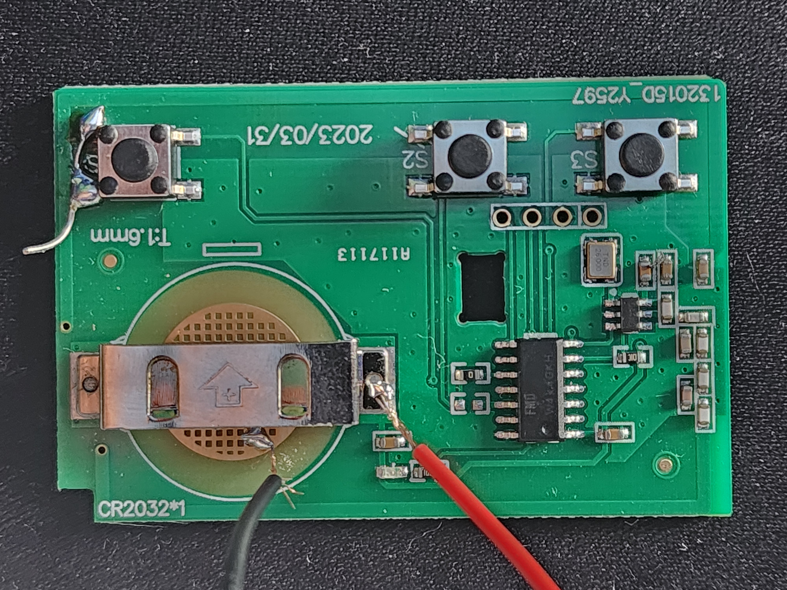
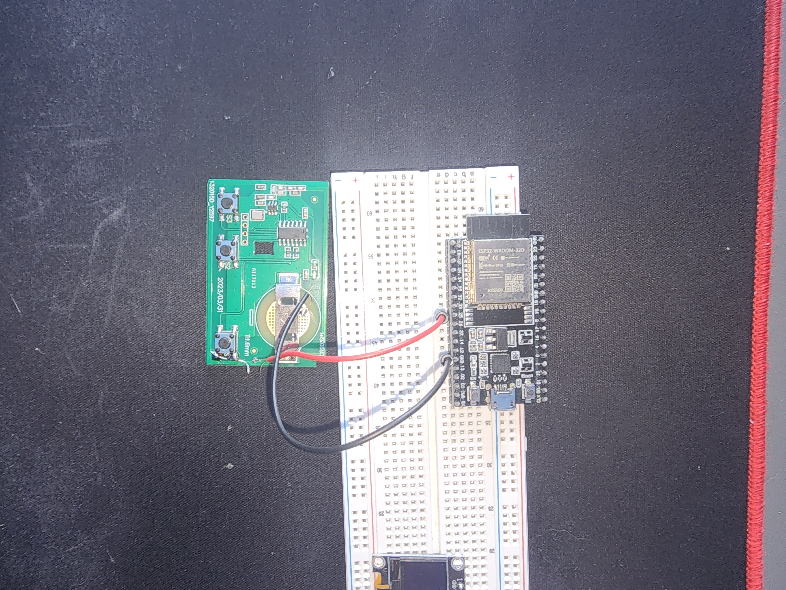

# The Problem
The problem I was trying to solve was a way to open and close the garage door, using WIFI instead which I could access anywhere rather then requiring the radio remote that comes with most Garage Doors, that only works when close by.
# Solution
Todo this I used an ESP-32 dev board. This chip allows for easy access to WIFI, it is able to run a basic web interface. The hardest part was communicating between the garage door and the ESP-32. My solution was, to solder power across the bottom that controls the garage door, so the button acted, as always being pressed. Luckily the ESP-32 output voltage, and a the garage doors remote voltage are the same 3.3 Volts. This makes it so when ever I provide power to the remote the it sends the radio signal to open the garage door.

# Final Remote Wiring

# Final Complete Wiring

